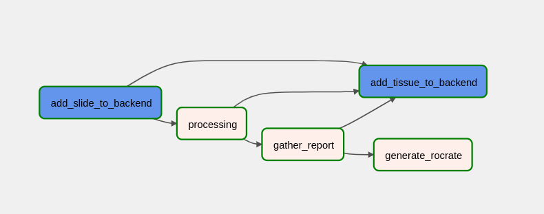

# Intro
This repository contains the computational workflows for the [CRS4 Digital Pathology Platform](https://github.com/crs4/DigitalPathologyPlatform)(CDPP).
It leverages [CWL-Airflow](https://barski-lab.github.io/cwl-airflow/) for processing whole slide images in a scalable and reproducible way. Each run takes in input a slide and can produce one or more outputs. At the moment, two workflows are provided: a basic one, which segments tissue on H&E slides, and another one providing, in addition to the tissue segmentation, prostate cancer classification.
The outputs of segmentation and classification tasks can be loaded in the CDPP, to be visualized as vectorial shapes and heatmaps respectively.

## Workflow structure

The picture above shows the structure of a basic workflow. Actually, it is the *basic_pipeline*  defined in ```data/dags/basic_pipeline.py```. The first step is ingesting the input slide into the CDPP. The second step is processing the slide. It can include multiple sub-steps; moreover, it can be defined in [CWL](https://www.commonwl.org/), to guarantee reproducibility. Next, the ouput (in this case the tissue segmentation) are loaded back into the CDPP. In parallel, provenance is tracked generating a [Workflow Run RO-Crate](https://www.researchobject.org/workflow-run-crate/). 


# Getting started
The preferred way to run workflows on the CDPP is via docker compose.
First, create, create ```.env``` file executing:
```
./create_env.sh
```
Then edit properly the output ```.env```. Be sure to set safe user/password values.


Edit env variable ```CWL_DOCKER_GPUS ``` for setting the gpus to be used on docker container used for predictions.

N.B
Change ```omeseadragon:4080``` in ome_seadragon.base_url and ome_seadragon.static_files_url to the local machine address.
The port is the same specified in omeseadragon-nginx service (docker-compose.omero.yaml).

## Deploy

```
./compose.sh up -d
```

Check if ```init``` service exited with 0 code, otherwise restart it. It can fail for timing reason, typically sql tables do not exist yet.

To visit Airflow, go to http://localhost:<AIRFLOW_WEBSERVER_PORT>.


## Upload data

Once the services are up and running (via ```./compose.sh```), put some data in the INPUT_DIR (variable defined in your .env file). For testing purpose, as input you can use the slide ```tests/data/Mirax2-Fluorescence-2.mrxs``` 

You can use ```slide_importer/local.py``` for running the *basic_pipeline* , i.e. the slide ingestion and the tissue segmentation (for H&E WSIs), or the more complex *pca_pipeline*, which classifies prostate cancer in addition to the tissue segmentation.

```bash
cd slide-importer
poetry install
poetry run python slide_importer/local.py basic_pipeline  --user $AIRFLOW_USER -P $AIRFLOW_PASSWORD --server-url http://localhost:8080  --wait --params '{"level": 8}'
# or 
poetry run python slide_importer/local.py pca_pipeline --user $AIRFLOW_USER -P $AIRFLOW_PASSWORD --server-url http://localhost:8080 -p '{ "tissue-high-level": 8, "tissue-high-filter": "tissue_low>1", "tumor-filter": "tissue_low>1", "gpu": null}'  --wait 
```

Parameters for the *basic_pipeline* are defined in ```cwl/extract_tissue.cwl```, while the ones for the *pca_pipeline* are defined in ```cwl/pca_classification_workflow.cwl```.

# Extending workflows


